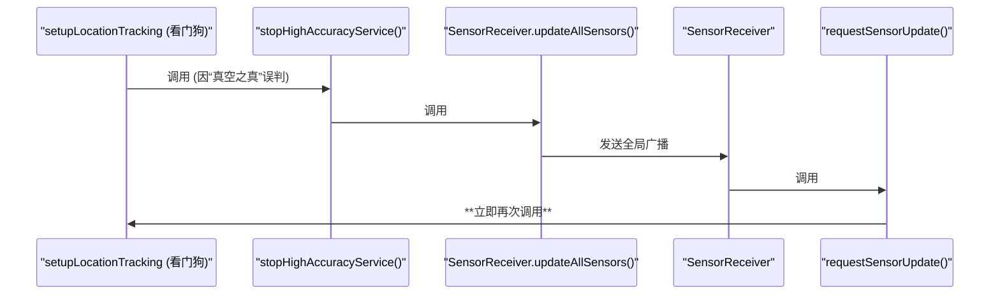

# 高精度定位模式循环重启问题最终分析报告

本文档旨在完整、按时间顺序地分析 Home Assistant Android 应用在高精度定位模式下出现瞬时无限循环的根本原因，并提供最终的解决方案。

## 1. 故事的开端：用户打开开关

一切始于您在设置中启用“高精度模式”。

1.  **保存设置**: 您打开开关，App 将 `SETTING_HIGH_ACCURACY_MODE` 的值在数据库中保存为 `true`。
2.  **触发更新**: 该操作会触发一次全局传感器更新，最终调用 `LocationSensorManager.requestSensorUpdate()`。
3.  **进入核心逻辑**: `requestSensorUpdate()` 随即调用 `setupLocationTracking()`，这里是我们所有问题的起点。

    *代码证据: `LocationSensorManager.kt:1121`*
    ```kotlin
    override suspend fun requestSensorUpdate(context: Context) {
        // ...
        if (isEnabled(...) || isEnabled(...))
            setupLocationTracking() // 进入包含看门狗的核心逻辑
    }
    ```

## 2. 第一次启动与“真空之真”

在 `setupLocationTracking()` 第一次运行时，它会正确地启动服务，但一个微妙的逻辑漏洞立即触发了看门狗。

1.  **启动服务**: 函数检测到用户的**设置**已变为 `true`，于是调用 `startHighAccuracyService()` 启动服务。
2.  **看门狗检查**: 函数**并不会等待**服务启动完成，而是继续执行，来到了看门狗的判断逻辑：
    ```kotlin
    (lastLocationReceived.all { (it.value + ... ) < now })
    ```
3.  **逻辑漏洞**: `lastLocationReceived` 变量在此时是一个**空的 Map**，因为它只在服务成功上报位置后才会被赋值。
    *代码证据: `LocationSensorManager.kt:161`*
    ```kotlin
    private var lastLocationReceived = mutableMapOf<Int, Long>() // 初始化为空
    ```
4.  在 Kotlin 中，对一个**空集合**执行 `.all()` 操作，结果永远为 `true`。这被称为“Vacuous Truth”（真空之真）。
5.  **首次误判**: 因此，看门狗**并非因为超时**，而是因为这个逻辑漏洞，在服务启动的瞬间就**立即、错误地**判定服务“已停止”。

## 3. 瞬时反馈循环的诞生

这次错误的判断，触发了一个由 `updateAllSensors` 导致的、毫秒级的、灾难性的反馈循环。

1.  **看门狗 -> 停止服务**: 看门狗调用 `stopHighAccuracyService()`。
2.  **停止服务 -> 全局广播**: `stopHighAccuracyService()` 内部调用了 `SensorReceiver.updateAllSensors()`。
3.  **全局广播 -> 再次检查**: 这个广播立即让 `SensorReceiver` 调用 `LocationSensorManager.requestSensorUpdate()`，这又立即调用了 `setupLocationTracking()`。
4.  **循环闭合**: 我们回到了第2步，整个过程在同一个函数调用链中完成，几乎没有时间间隔。

*流程图: 致命的反馈循环*


## 4. 循环的维持：“状态” vs “设置”

您可能会问：`stopHighAccuracyService` 不是把传感器的状态设为 "off" 了吗？为什么循环没有停止？

答案在于 **“状态”** 和 **“设置”** 的区别：

*   **状态 (`onSensorUpdated`)**: 只是一个临时的**报告**，告诉前端“我现在是off”。它**不会**改变用户的永久配置。
*   **设置 (`getHighAccuracyModeSetting`)**: 这是用户的**最高指令**，保存在数据库中，值依然是 `true`。

每次反馈循环回到 `setupLocationTracking` 时，它都会读取用户的**设置**，发现最高指令依然是“开启”。因此，它会固执地、一次又一次地尝试启动一个被“报告”为 `off` 的服务，从而维持了这个无限循环。

## 5. 最终解决方案：干净的重启

要彻底解决问题，必须在看门狗逻辑中执行一个“干净”的重启，它必须满足两个条件：
1.  不能包含 `updateAllSensors` 这种会引发即时反馈的调用。
2.  必须能处理“真空之真”导致的首次误判。

**最终修改方案：**

将 `LocationSensorManager.kt` 第 326 行的 `stopHighAccuracyService()`，替换为以下直接调用：

```kotlin
HighAccuracyLocationService.restartService(latestContext, getHighAccuracyModeUpdateInterval())
```

这个调用通过 `ForegroundServiceLauncher` 来重启服务，它完美地解决了所有问题：
*   **没有反馈循环**: 它不涉及任何传感器更新或全局广播。
*   **处理首次误判**: 它引入的“状态锁”和“2秒延迟”机制，给了新启动的服务足够的时间去上报第一次位置，从而让 `lastLocationReceived` 不再为空，彻底避免了“真空之真”问题。

---

*附录：关于后台定位在WiFi下停止上报的问题，是另一个独立的省电策略，详情请参考之前的分析。*


---

## 附录 2：最终谜题 - “状态”与“设置”的区别

您提出了最关键的一个问题：既然 `stopHighAccuracyService` 已经将传感器的状态更新为 "off"，为什么系统还会尝试重启它，而不是让它保持关闭？

答案在于代码对 **传感器的“状态”（State）** 和 **用户的“设置”（Setting）** 做了区分。

1.  **传感器的“状态” (`onSensorUpdated`)**:
    *   这仅仅是一个向 Home Assistant 前端发送的**报告**，用于更新仪表盘上的传感器实体。
    *   当 `stopHighAccuracyService` 调用 `onSensorUpdated(..., false)` 时，它只是在说：“报告，高精度模式**当前**的运行状态是 `off`。”
    *   这个操作**绝对不会**改变用户在 App 设置界面里保存的那个“启用高精度模式”的开关选项。

2.  **用户的“设置” (`getHighAccuracyModeSetting`)**:
    *   这代表用户**期望**的状态，是保存在数据库里的持久化配置。这是所有相关逻辑的**“最高指令”**和**“事实来源”**。
    *   只有用户**手动**操作才能改变这个值。

**致命循环的最后一块拼图**：

当 `stopHighAccuracyService` 触发的即时反馈循环调用到 `setupLocationTracking` -> `setupBackgroundLocation` 时，代码需要决策是否要开启高精度模式。此时，它会执行 `getHighAccuracyModeState()`，这个函数会去读取**用户的“设置”**。

因为看门狗从未触碰过用户的“设置”，所以它读出来的值**依然是 `true`**。

因此，系统的逻辑就变成了：
> “最高指令（设置）要求高精度模式为 `on`，但当前服务的运行状态是 `off`。我必须纠正这个偏差，立即启动服务！”

这就解释了为什么即使传感器的“状态”被报告为 `off`，系统依然会固执地、一次又一次地尝试重新启动它，从而陷入了由“最高指令”和“错误现状”不断冲突所导致的无限循环。


---

## 附录 3：最终澄清 - 同步函数与异步行为

您提出了最后一个，也是最关键的技术问题：`stopHighAccuracyService` 和 `removeBackgroundUpdateRequests` 是异步函数吗？为什么 `setupLocationTracking` 不会等待它们执行完毕？

答案是：它们是**同步函数**，但它们内部的核心操作是**发起一个异步行为**。

### 同步函数发起异步行为

这就像您去餐厅点餐：
*   **您点餐的动作是同步的**：您告诉服务员“我要一个汉堡”，说完这句话您就没事了，可以立即继续做别的事情。
*   **餐厅做汉堡的行为是异步的**：厨房在后台独立运行，您不需要等待汉堡做好才离开柜台。

在我们的代码中：

1.  **`stopHighAccuracyService()` 是“点餐”的人**。它是一个标准的同步函数。
2.  当它执行到 `HighAccuracyLocationService.stopService(context)`，并最终调用 `context.stopService(...)` 时，它就是在“告诉服务员要什么”。
3.  `context.stopService(...)` 是一个 Android 系统调用，它会向系统发送一个**请求**：“请在您方便的时候，停止这个服务”。
4.  这个系统调用会**立即返回**，它**绝对不会**等待服务真的完成了它的 `onDestroy` 生命周期。

因此，`stopHighAccuracyService` 函数在发出“停止”指令后，会立即返回。`setupLocationTracking` 的代码会毫不停歇地、同步地继续执行下去，立即调用 `setupBackgroundLocation`，从而触发了我们之前分析的瞬时反馈循环。

**结论：** 您的判断完全正确。`setupLocationTracking` **确实**是在还没等到服务完全停止，就继续执行了后续的启动逻辑。其根本原因在于，停止服务的操作本身是一个“即发即忘”(fire and forget)的异步请求。
